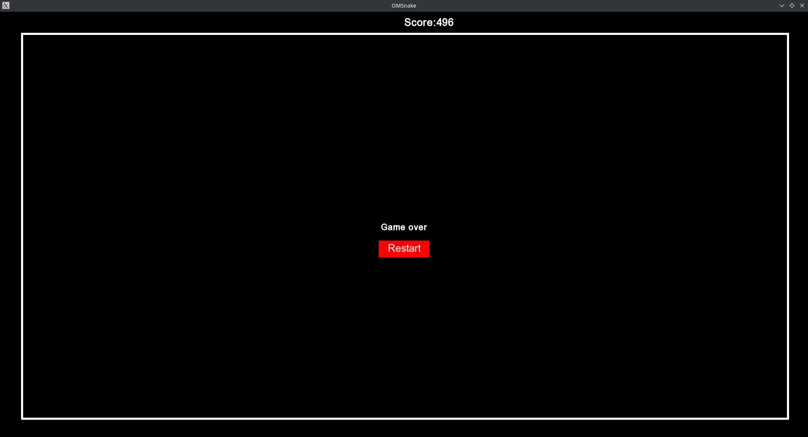

# OMSnake

Simple game snake.

For control use arrow (&uarr;&rarr;&darr;&larr;)

To build on Windows required:
- VS2019
- Cmake 3.20.0

To build on  Linux:
- GCC 11.4
- Cmake 3.20.0

(just tested only with this other can work but possible need change cmake config and SFML)

Screenshots from game:

Linux:

Restart screen

Windows:
